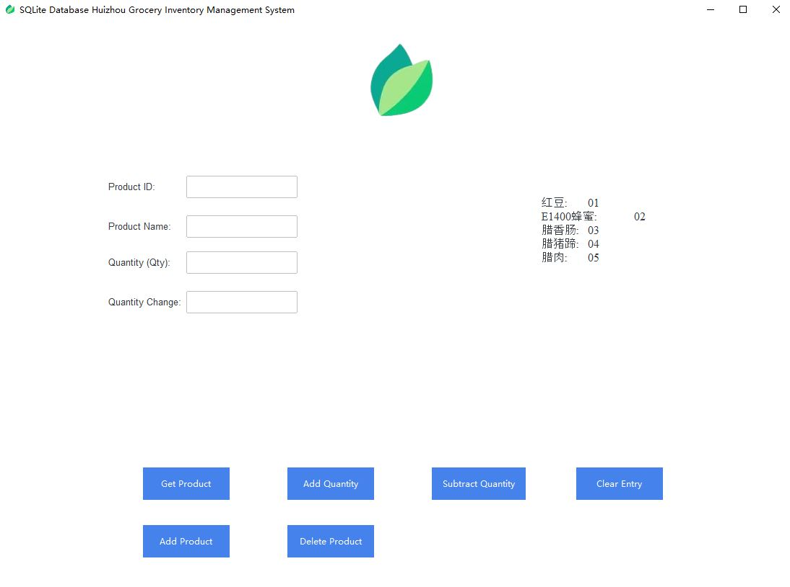
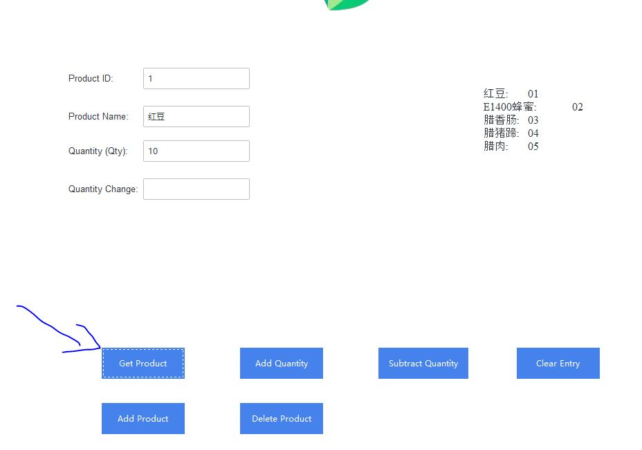
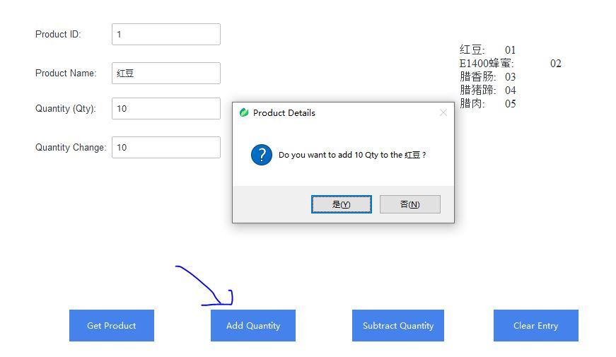
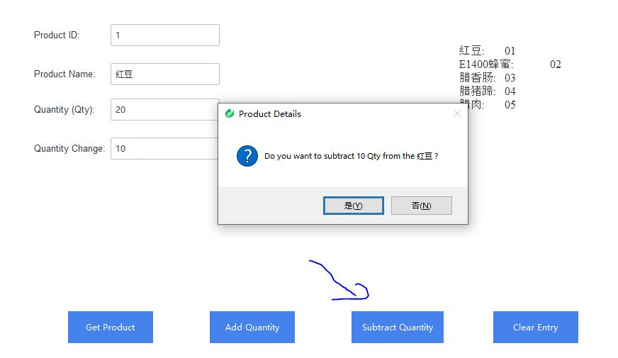
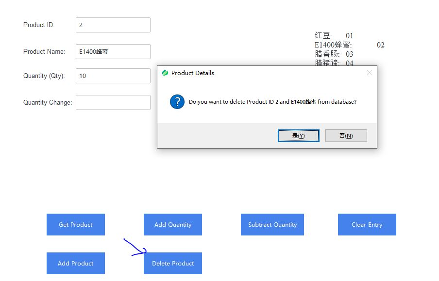
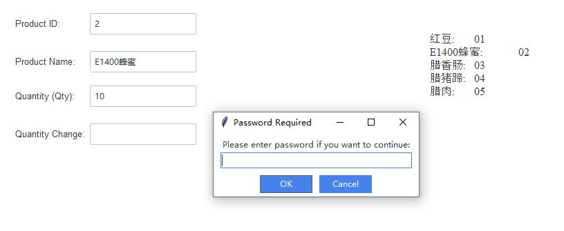
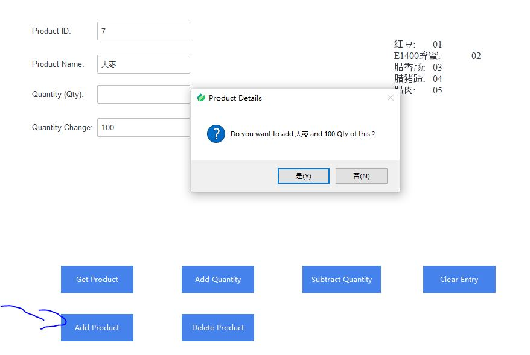
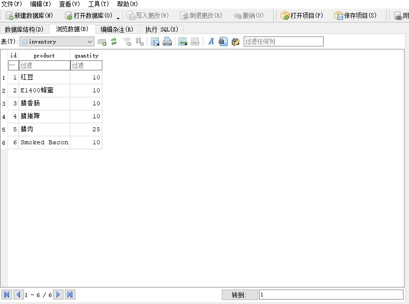

<div align="center">
  <h1 align = "center">Huizhou Grocery Inventory Management System </h1>
</div>

[](/LICENSE)

We are designing our own IMS and saving our IT costs. This is still a lightweight and beta version for our project. We could develop new functions based on our needs.

If you want to test it, you need to download Python code and install ttkbootstrap.

```shell
pip install ttkbootstrap
```
<br/>

After you can run Python code on your terminal, you need to run this code below.
```shell
pyinstaller --onefile --name Huizhou-IMS -i logo.png --windowed Huizhou-IMS.py
```
<p align="center">
  
</p>

You will get an exe file in your working directory (/dist).


<p align="center">
  
</p>

You could find the same GUI as our POS system. And this time we do not need to set up our printer, and we need to create a SQLite DB file in our environment, and Python code will connect it. We just pasted some screenshots to show our desktop app.

<p align="center">
  
</p>

You just need to input the product ID and click the Get Product button. You will get the product name and quantity from your local SQLite database.


<p align="center">
  
</p>

<p align="center">
  
</p>

You could add or subtract Qty smoothly!

<p align="center">
  
</p>

<p align="center">
  
</p>

<p align="center">
  
</p>

We have created a password-required function when you need to add or delete products from a database. Default password is 12345, and you could change it in your Python code.

<p align="center">
  
</p>

You may feel this Python code let SQLite DB Browser become a simple inventory management system. Definitely, you could add categories, brands, and descriptions in there. It is easy to check all product details.

Python has many functions we could explore, and we hope Python could be less code and more function.


